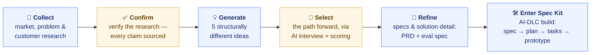

# HCP Case Study — AI Collections Teammate

A product case study for **Housecall Pro (HCP)**, from **Gil Strickland**; a
brief on the FinTech team: an AI teammate that helps home-service Pros get paid.

👉 **Try it live:** [hcp-case-study.vercel.app](https://hcp-case-study.vercel.app) — a running Next.js app (source in [`prototype/`](prototype/)).

## How this addresses the brief

**Problem framing.** The pain point: home-service Pros are owed money on overdue
invoices but hate chasing it — it's awkward, time-consuming, and easy to drop.

*Good* looks like more invoices paid, sooner, without the Pro doing the nagging. All while
retaining the relationship with the customer.

*Failure* looks like nagging a customer who already paid, or pushing so hard the Pro
loses the relationship — so the prototype is built to prevent exactly those.

**Solution design.** The AI reads each overdue invoice, relationship history, invoice history, 
figures out *why* it's unpaid, and drafts the right follow-up. It does the reading, diagnosing, and
drafting **autonomously**; it **hands back to the Pro** anything requiring judgment —
approving sends, disputes, "I already paid" replies, and VIP customers. 

*Non-AI alternative considered:* the standard fixed reminder schedule (send at 7/14/30 days) with 
expanded templates.
It's cheaper, but it treats every unpaid invoice the same and can't tell a forgetful
customer from an angry one — the dynamic reasoning diagnosis is the whole value, and that needs AI.

**Trust and failure.** When the system is **wrong or unsure, it stops and asks** rather
than guessing. If a customer replies *"I already paid,"* it halts and freezes all their
invoices until the Pro looks — no dunning a paid customer. 
**Trust builds gradually:**
the Pro starts by approving every message; as the AI proves itself per late reason
segment, it earns more autonomy — always visible, always reversible with one slider.

**Measurement.** The outcome metric that matters is **weighted recovery** — hard
collections credited more than easy dollars the Pro would've gotten anyway — so the
metric can't be gamed. The quality bar is a **15-case eval spec** — a documented test
set covering every failure mode, ready for a teammate or PM to run against the agent:
**zero critical failures (a wrong send that breaks trust), or it doesn't ship.**

---
# Deeper detail:

The bet: an AI teammate that helps home-service Pros get paid. For each overdue
invoice, it reads the customer's history, figures out *why* they haven't paid, drafts
the right follow-up in the Pro's voice, and handles replies — escalating to the Pro
whenever judgment is needed. **A teammate, not an autopilot.**

## What it does

- **Ranks** overdue invoices by who to chase today, not just by age.
- **Diagnoses** why each invoice is unpaid — forgot vs. can't pay vs. disputes vs.
  won't pay — because each needs a different message.
- **Drafts** the follow-up; the Pro approves, edits, or sends.
- **Protects trust:** if a customer says *"I already paid,"* it stops and freezes all
  their invoices until the Pro looks — no dunning someone who already paid.

## Key decisions I made

- **Picked the one problem no one owns** — the collections/reply step in the payment
  flow — over four other candidates.
- **Reframed the problem:** late payment isn't one behavior, it's four. That's what
  makes the AI genuinely useful instead of a fancier reminder.
- **Put the safety rules in code, not the AI's prompt.** The model writes; hard-coded
  logic decides what's allowed to send. That's what makes "never dun a paid customer"
  a guarantee, not a hope.
- **Measured the right thing:** hard collections count more than easy dollars, so the
  metric can't be gamed.

## How I worked with AI

This was **not a vibe-coding session.** It was a normal product lifecycle —
research → problem framing → PRD → spec → build → eval — run with AI as a **partner**.

*Blue steps are where AI did the heavy lifting; amber steps are the human judgment
gates — verifying the research and choosing the bet — where I made the call before
letting the process advance.*

**AI moved fast; I made the calls.** AI drafted, generated options, and turned my
approved specs into code. I set direction, chose the bet, made the architecture
decisions, and signed off on every output. **Nothing shipped that I didn't understand
and agree with.**

**A few things I deliberately kept away from the AI:**

- **The safety rules.** Those are hardcoded so the model can't override them.
- **The choice to include the customer/Pro relationship context for reasoning.**

Deciding *what to trust the model with* was mine to make.

**Where AI got it wrong — two examples I caught and corrected:**

- *A correctness miss.* It mislabeled one customer dispute. My eval caught it on the
  first run; I fixed it and re-ran clean. That's the point of the eval.
- *A legibility miss.* AI built the "Recent wins" dashboard exactly to spec — but the
  spec exposed an internal scoring number ("weighted credit") as a second dollar column
  next to the real dollars collected. It was technically faithful and genuinely
  confusing: a Pro sees `$240 collected` next to `$190 weighted credit` and thinks
  *"where did my $50 go?"* — it reads like an accounting error. I caught it in design
  review and reworked it to show one real number (dollars recovered) plus a
  plain-language tag ("Tough win" / "Handled for you"), and moved the anti-gaming idea
  into a single headline: *"$2,900 recovered — $2,130 of it from customers who usually
  don't pay."* The lesson: "matches the spec" isn't the bar; "makes sense to the user"
  is — and that judgment was mine to make.

## What's in this repo

| Folder | What |
|---|---|
| [`Case Study Artifacts/`](Case%20Study%20Artifacts/) | The written deliverables: brief, problem framing, PRD, eval spec, AI logs. |
| [`prototype/`](prototype/) | The working app (run instructions in its README). |
| [`prototype/speckit/`](prototype/speckit/) | The Spec Kit spec that drove the build (constitution, spec, plan, tasks). |
| [`context/`](context/) | Background research and the HCP design system. |

*Built by Gil Strickland — AI as partner, the decisions and the responsibility mine.*
